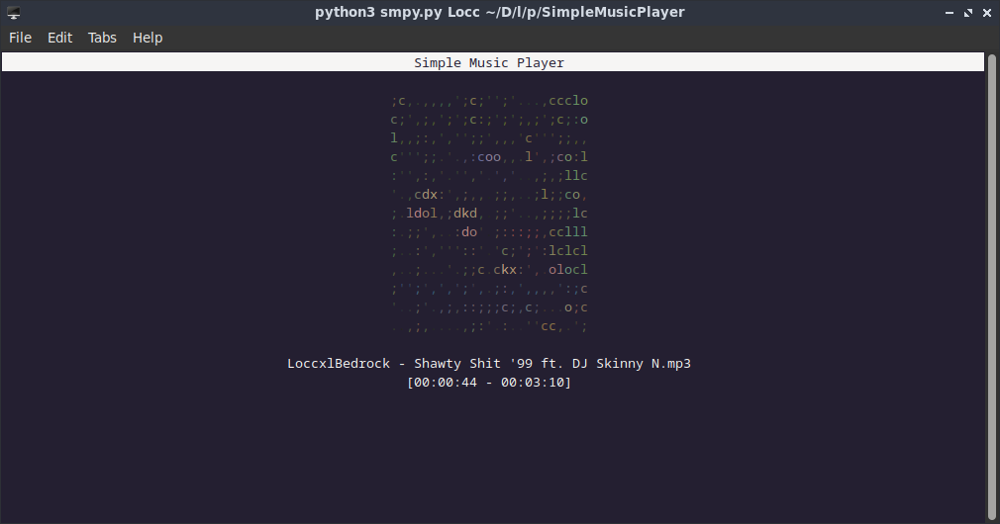

# SimpleMusicPlayer
A Simple Music Player made with python curses for Linux<br />Also uses jp2a for the Image or Art cover<br />


# Usage
```
$ python3 smpy.py <Audio File> <Image/Art Cover File>
```

# Keys
Q or ESC: Quit the player <br />
P: Pause <br />
R: Repeat the audio<br />
